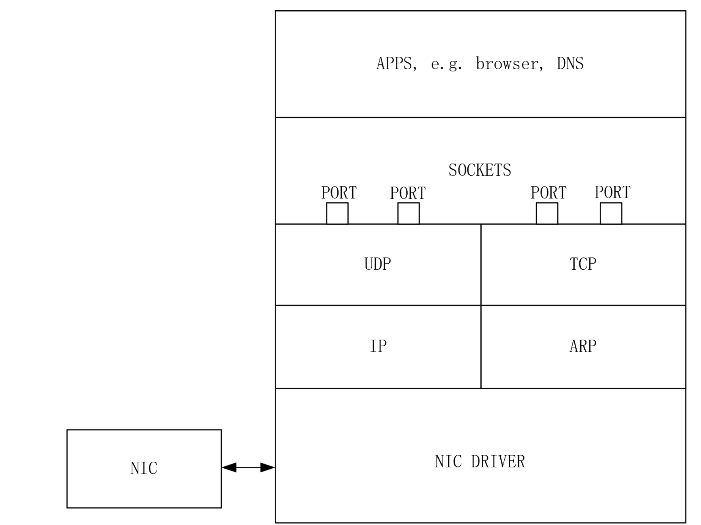
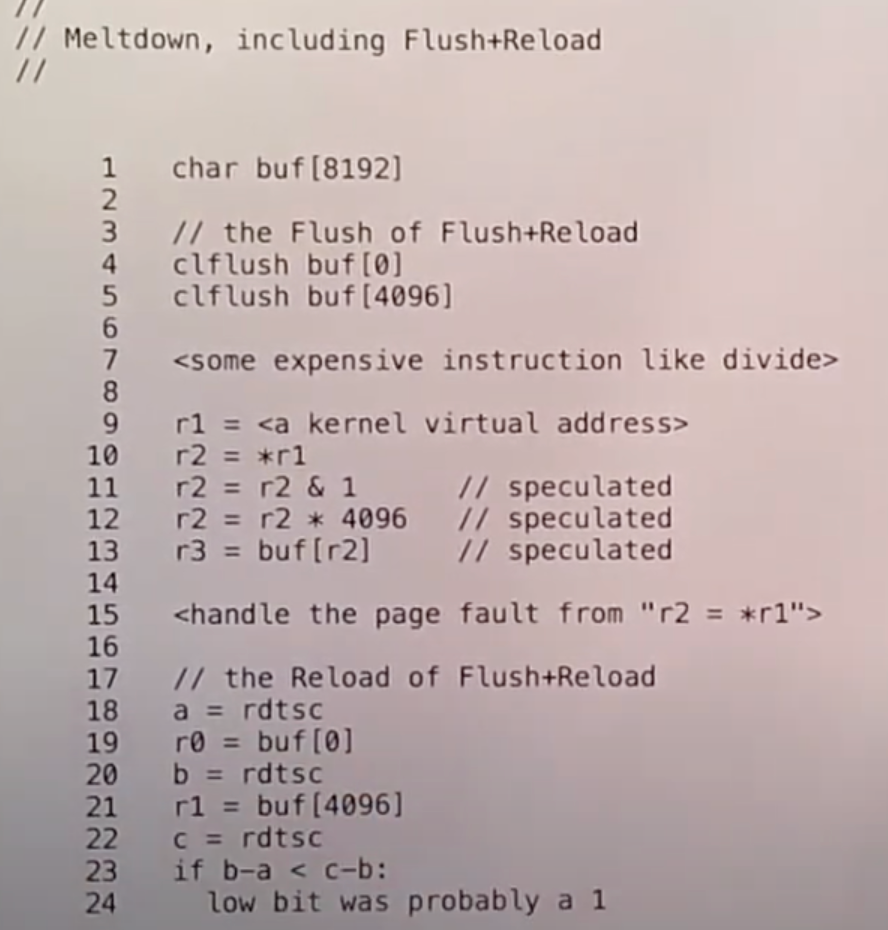
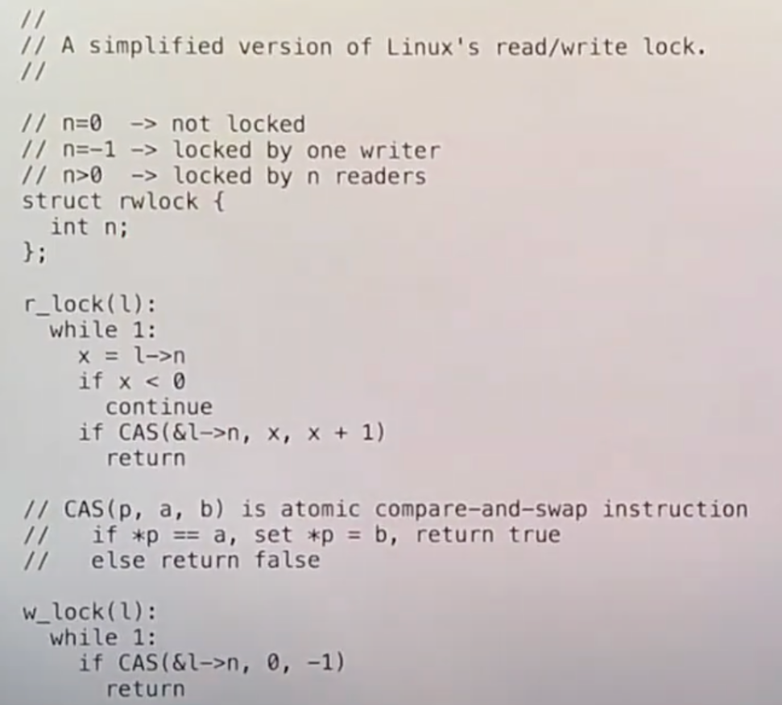

# File system performance and fast crash recovery

主要是看linux中使用的ext3文件系统，ext3是在ext2的基础上加上日志。

所有的log系统基本都需要坚持两个原则：write-ahead rule and freeing rule. 后文称为”两原则“

- write-ahead rule: 一堆写操作具有原子性，文件系统需要将所有的写操作记录在log中，然后才能写到实际位置
- freeing rule: 只有log中一个事务的所有写操作都被写入到实际位置才可清除。

## ext3 file system log format

ext3与xv6类似，首先在内存中有block cache，（write-back cache），其中有些是干净的数据有些是脏的。因为“两原则”，有些cache需要固定，即不可以被写回disk。

ext3的log可以同时存在多个transaction，每个事务维护如下信息：（由此可以看出维护的这些信息是再内存中）

- 序列号
- 该事务修改的block号，这些block号指的是cahce中的，因为修改最初都是在cache中。
- 一系列handle，handle对应syscall，这些系统调用是transaction的一部分，会读写cache中的block。

ext3的磁盘结构也与xv6类似，一个文件系统树，包含inode、目录、文件等，有bitmap block标志每个data block是是否被分配。有log区。

磁盘上的log区：（一段连续的block）

- 最开始是super block，这是log的super block，记录了log中第一个有效的事务的起始位置和序列号，起始位置就是事务在log区中的块号。super block后是存放事务的块。
- 每个事务包含：
  - 一个descriptor block，类似于xv6中的header block。包含log数据对应的实际block号
  - 每个block号的更新数据
  - 最后是一个commit block。
- 多个事务连一起，前一个事务的commit连着下一个的descriptor。
- 为了区分，descriptor会以一个32bit的魔法数字开头。

同一时间只会有一个事务在进行，在内存中，对应的syscall更新cache中的快。当ext3决定结束事务，先开启一个新的事务，然后将完成的事务写入磁盘。log磁盘中有已经完成的事务，logging系统在后台将完成的log写到实际块。log是循环的，用到最后会回到开始。

## ext3如何提升性能

三种方式：

- 异步系统调用。syscall写入磁盘之前就返回了，syscall只更新cache，不等待写disk。不过可能等待read disk
- 批量执行，将多个syscall打包成一个事务
- 并发

---

异步系统调用：

syscall能够快速返回，而xv6需要等待写磁盘。使得I/O可以并行运算，syscall返回，文件系统在后台执行写disk。磁盘操作和syscall并行。

同时让大批量执行容易。

缺点是，同步问题。对文件的syscall已经返回，用户收到返回，但是还没有写入disk，这时crash，那么重启后可能没有了。尤其对数据库文本编辑器这些应用程序。

文件系统提供了fsync系统调用，接受一个fd，所有数据写入disk后才返回，有时也叫flush。

---

批量执行：

一段时间后开启一个事务，在此期间所有的syscall都在这个事务里。好处有很多：

- 在多个syscall之间分摊了事务的固有损耗，包括写事务的descriptor和commit。在disk查找log位置也很费时。
- 多个系统调用可能用到同一个块，更容易触发write absorption。简单说就是空间局部性。
- 磁盘调度。log中是连续分区，disk写连续分区总是快的。而对于write to home，一次送给disk多个块，那么磁盘可以按某种算法调度，以减少寻道时间。

---

并发：

ext3允许多个syscall同时执行。

可以有多个不同状态的事务同时存在：

- 一个open transaction
- 若干个正在commiting to log
- writing to home
- freeing

---

如果一个block正在commiting to log, 此时另一个事务中要写这个块怎么办？

ext3结束当前事务前，会拷贝用到的block cache，然后commit的是副本，这里为了效率使用cow。

## ext3 syscall format

系统调用需要声明对写操作的开始和结束。syscall先调用start函数，每个syscall call start()后，获得一个handle唯一标识了当前的syscall，然后syscall需要读写block，通过get(handle，blockno)获得block在buffer中的缓存，同时告诉handle这个block需要被读或写，如果操作多个block那么会执行多次。get函数告诉logging，这个block是handle对应的事务的一部分。然后修改buffer中的block。此syscall结束时调用stop(handle), 文件系统需要直到sysall属于哪个事务，因此需要将handle传入。

只有事务中所有的syscall都结束，才能commit。事务需要记录所有开始的handle ，stop只是告诉他结束了一个syscall。

## ext3 事务commit步骤

1. 阻止新的syscall，（会损害性能）
2. 等待包含在事务中的syscall结束。
3. 所有的syscall结束，开始一个新的事务。
4. 更新descriptor block
5. 将被修改的block从buffer写入log
6. 等待写log结束
7. 写入commit block
8. 等待commit block写入结束。这个就是commit point
9. write to home
10. reuse log

重用问题，如果log不够用，那么需要其他事务log的清除，如果没有足够空间开commit，不能开启一个新的事务。

为什么阻止新的syscall？考虑下面的情况：

如果事务T1只有一个create系统调用，创建文件x，然后事务commit，等待create完成。此时开一个T2，unlink(y), T1的create发现y释放的inode假设是17并用了它，然后T1写入log，在T2关闭前crash，恢复时看到T1，那么将T1恢复，也就是说inode17是x，但是T2并没有写入磁盘，所以inode17没有被释放，y也是17，那么两个文件用了一个inode。

## ext3文件系统恢复过程

从super block找到开始的事务，然后扫描已经commit的事务，直到找到最后一个，后边的可能是一个由开始块但是没有commit块的，忽略，然后从头开始恢复。恢复期间不可以执行任何程序。

如果一个数据块以魔法数字开头，在descriptor中有一个bit记录该块以魔法数字开头，然后将data中的前32bit置为0，在write to home时恢复，所以只有descriptor以魔法数字开头。

## other

有一个内核线程（实际可能有多个）来处理disk的log。

commit中也有事务号，所以不会出现一个新事物在最后写commit时crash，但是又恰好是被清除事务的commit，导致恢复程序认错。

在写descriptor时就已经知道了这个事务有多少个block。

所以这个commit块可以不用，可以像xv6一样放在开始那个块。实际上et4这么做了。他同时写data block和commit，磁盘可以无需执行写，有可能先写了commit但是没有data，所以ext4加入了校验。

ext3有3中写入data block的方法。journaled data ordered data and writeback. 在配置ext3文件系统时需要告诉linux要哪种。

- journaled data: 就是写两遍。先写到log，在写到data
- ordered data：最常见的，log中只写元数据，data直接写到home。ext3写完data后再commit，这样如果写操作将元数据和commit写到log但是data还没有写完，然后crash，那么你那个data是错误数据。但是后commit就不会有问题。

# Virtual memory for application

## 特性

os内核使用了灵活的page table，例如lazy allocation and cow。应用程序也可以从这些灵活的虚拟内存中获益。例如垃圾回收机制和共享虚拟内存(mmap)

所有这些用户程序需要以下特性

- 需要trap让发生在内核中的page fault传播到用户空间，然后再用户空间的handler处理对应的页中断。
- Prot1，降低一个page的accessability，也就是page的读写权限。除了prot1，还有protN，因为prot1需要一次需要修改标志未，再清除快表，如果protN只是单纯的多次调用prot1，那么会多次修改快表，所以有protN，只修改一个快表
- Unprot，增加page的权限
- 查看内存page是否是dirty
- map2，使一个应用程序可以在特定的内存空间映射两次。并且这两次可以有不同的权限。

## 相关的系统调用

mmap():

```c
void *mmap(void *addr, size_t length, int prot, int flags,
                  int fd, off_t offset);
int munmap(void *addr, size_t length);
```

mmap除了以可映射文件还可以映射匿名内存。对应map2

mprotect()：`int mprotect(void *addr, size_t len, int prot);`修改权限。对应特性prot1、protN

sigaction：应用程序设置一旦某个signal发生就调用对应的handler，对应特性trap

## 虚拟内存如何支持应用程序

地址空间包含一些os的数据结构，称为VMAs(virtual memory areas). 每个vma对应一个连续的地址段section。连续地址段的所有page具有相同的权限。

假设一个pte是invalid或只读，你想要写，那么cpu会跳转到trampoline，kernel保存用户程序状态，例如是segfault，应用程序设置了一个handler处理，那么这个事件会传播到用户空间，用过用户空间的upcall在用户空间运行handler，handler运行完返回内核代码，内核恢复执行。

## 垃圾回收

//TODO:GC

# Os organization

## Monolithic kernel

宏内核，传统的操作系统实现方式，是一个完成了很多功能的大的程序。提供强大的抽象。好处是：

- 高度抽象的接口可移植，无论是什么样的存储设备都可以以同样的接口运行。
- 向应用程序隐藏复杂性。例如提供地址空间而不是直接访问MMU硬件。
- 强大的抽象帮助管理共享资源。例如将内存外存交给内核管理。
- 所有的功能都在一个内核程序中，使得他们彼此之间可以互相访问各自的数据结构。
- 内核的所有代码都以完整的硬件权限运行。

缺点：

- 大且复杂。过于复杂的结构很容易产生安全问题。
- 为了通用性功能多而全，但是很多设备可能只使用一小部分。并且通用一般就会更慢。
- 太大反而削弱了某些复杂的抽象能力，内核有许多设计考虑，应用程序必须遵守。
- 可扩展性差。

## Micro kernel

微内核的核心是实现IPC(inter-process communication)以及线程和任务的tiny kernel。微内核只提供进程抽象和通过IPC进程间通信的方式，其他的例如文件系统等都通过用户空间进程实现，kernel只负责进程之间的通信。内核中唯一需要做的就是支持进程/任务/线程以及IPC来传递消息。

IPC这种思想不止在微内核在宏内核等各种OS中都很常见。

可能的优势：

- 代码少，容易优化，容易验证是否安全
- 设计限制更少，给应用程序提供更多的灵活性
- 原本位于内核的很多东西现在位于用户空间，更容易模块化
- 更容易定制化
- OS更健壮，大多数的错误来自驱动，微内核驱动不在内核里
- 可以在微内核运行多个OS

存在的挑战：

- syscall api不好设计，可能内核需要提供一些syscall，但是又不知道例如文件系统等。
- 性能，宏内核文件系统可以和虚拟内存直接交互，但是微内核不行

# Virtual Machine

在硬件之上是HOST空间，存在一个Virtal machine monitor(VMM)或者叫Hypervisor，上面一层是Guest空间，运行OS kernel，GUest也有Supervisor mode and User mode。

在Guest操作系统上运行特权指令会trap到VMM。

## trap and emulate

VMM会为每个虚拟机维护一套虚拟状态信息，主要是特权寄存器，当guest os需要访问特权寄存器那么会trap到VMM，这种风格叫trap and emulate。在guest os中会有两种触发trap的方式，一种是guest usermode syscall，另一种是特权指令。

为什么要有虚拟特权寄存器？假设guest user syscall，此时SCAUSE reg是ECALL，但是guest内核的trap handler需要读这个reg，此时引发另一种trap，那么SCAUSE被改变，但是我们不能然guest os知道。

VMM需要知道guest运行的模式，因此页维护guest os的mode信息，当sret时更新为user mode。还维护了cpuid。

guest中的用户代码，如果是普通指令，直接在硬件上运行。

例如guest user syscall，执行ECALL，这是特权指令，进入VMM，此时VMM发现是user mode执行ECALL，VMM更新一系列的虚拟寄存器，然后将真实的SEPC设置成虚拟的STVEC， 之后VMM调用sret返回，因为真实的SEPC被设置为虚拟的STVEC，所以返回到guest的trap handler。

### trap and emulate---page table

Guest有page table，但是我们不能只是简单的让guest修改SATP reg通过trap进入VMM，然后VMM就设置SATP成guest想要的，因为这会导致guest可以访问任意的内存。所以VMM会为每个虚拟机维护一个映射表，Shadow page table：

* 从Guest Page Table中取出每一条记录，查看gpa。
* 使用VMM中的映射关系，将gpa翻译成hpa。
* 再将gva和hpa存放于Shadow Page Table。

所以guest看到的page table，他会以为那就是正常的page table，但是实际上使用的是VMM维护的shadow page table。

另一种guest与page table交互的方式是修改pte，在riscv中修改了pte并且希望MMU看到，那么需要执行一条特权指令，此时会trap进VMM，VMM负责修改实际的page table。

### trap and emulate---devices

三种策略：

- 模拟真实硬件。guest仍然像与真实硬件交互一样，VMM不映射这些设备对应的内核地址，因此trap进VMM，VMM模拟硬件相应guest。
- 提供虚拟设备。这种情况下，guest知道自己是虚拟的。guest设备驱动中美欧memory mapped reg，而是在内存中有一个命令队列，guest将读写设备的命令写入队列，然后VMM读取。减少了trap，速度更快，但是通用性不如上一个
- 堆真实的设备pass-through，例如网卡，每个guest拥有硬件的一部分。

## 硬件对虚拟机的支持

trap and emulate虚拟机方案有太多的trap，性能不好，而且，这得益于riscv对虚拟机的支持，因为有特权寄存器和特权指令。

硬件自己有虚拟寄存器，在guest mode下使用。intel称为non-root mode. 如果想要创建一个新的虚拟机，在VMM中维护一个结构体VMCS(virtual machine control structure)，存储一些虚拟机的初始信息，VT-x硬件与这个结构体交互。这样普通的特权指令就可以直接在硬件上运行，但是仍然有一些指令会trap到VMM.一个是VMCALL，另一个是定时器中断。意味着一个虚拟机不可以持续占有虚拟机，就像线程不可以持续占有cpu。

VT-x另一个是对page table的支持。intel中类似于SATP的寄存器CR3，guest可以直接加载任何想要的值到CR3，VT-x中存在另一个reg：EPT(extended page table)。当启动一个虚拟机会为他设置一个EPT。CR3将gva翻译成gpa，EPT将gpa变成hpa。

## Dune: Safe User-level Access to Privileged CPU Features

用硬件对虚拟机的支持实现一些linux进程的其他操作。

简单来说就是利用VT-x，将进程当作一个虚拟机，内核中有一个Dune，他管理进程，进程又有自己的guest supervisor mode和uguest user mode。在super下可以访问CR3，当然dune也会控制EPT。

# kernels and hll

## c语言的优缺点

优点：

- c提供了大量的控制，例如可以完全控制内存的分配和释放。
- c几乎没有隐藏的代码，看源码就相当于看机器指令
- 可以直接访问内存
- 很少的依赖。

缺点：

- buffer overruns:数组越界，stack溢出
- use-after-free bugs
- threads sharing dynamic memory

# Networking

## 二层网络：Ethernet

局域网(Local Area Network)下各个主机都是通过Ethernet进行连接

Ethernet frame结构：start flag + 48位目标eth地址 + 48位源eth地址 + 16位ether type（payload中的数据协议类型）+ payload + end flag。eth地址由NIC的制造商决定

```c
// an Ethernet packet header (start of the packet).
struct eth {
  uint8  dhost[ETHADDR_LEN];
  uint8  shost[ETHADDR_LEN];
  uint16 type;
} __attribute__((packed));
```

## 二三层地址转换：ARP

Ethernet协议足以将packet在LAN中传送，但是如果需要将packet传送给远程Host，需要IP地址。ARP协议是将IP地址翻译为eth地址的协议，嵌套在ethernet packet中(即ether header后面就是ARP header，ARP header是ether header的payload)，ARP广播一个packet，表示拥有这个32bit IP的主机，返回对应的对应的eth地址。ARP没有payload。
```c
// an ARP packet (comes after an Ethernet header).
struct arp {
  uint16 hrd; // format of hardware address
  uint16 pro; // format of protocol address
  uint8  hln; // length of hardware address
  uint8  pln; // length of protocol address
  uint16 op;  // operation

  char   sha[ETHADDR_LEN]; // sender hardware address
  uint32 sip;              // sender IP address
  char   tha[ETHADDR_LEN]; // target hardware address
  uint32 tip;              // target IP address
} __attribute__((packed));

#define ARP_HRD_ETHER 1 // Ethernet

enum {
  ARP_OP_REQUEST = 1, // requests hw addr given protocol addr
  ARP_OP_REPLY = 2,   // replies a hw addr given protocol addr
};
```

## 三层网络：Internet

IP packet的ethernet type=0x0800，IP header中包括了32位的IP地址，高位的IP地址是network number来帮助router将packet进行转发，protocol number让接收者知道这个IP packet的更高级协议是什么。在packet从一个router转发到另一个router的过程中，ether header会被除去，但是IP header一直是保留着的

## 四层网络：UDP

UDP是传输层协议，根据sockets API规定了当一个packet到达正确host时需要被发送到的端口号，操作系统将把这个端口号上获取的packets作为一个file descriptor以供进程读取。端口号53是DNS server指定的端口号

## 网络协议栈



## Ring Buffer

网卡收到packet，产生中断。网卡的内存有限，因此会尽快拷贝到内存，之后在一个独立的线程中，会有一个Ip processing thread。读取内存中的packet队列，决定怎么处理。

网卡发送一个packet，也会触发中断。ip processing thread 不能和中断处理程序同时运行(在同一CPU上)。中断优先级更高。

当packet到达时，网卡将其存在自己的缓存，并向主机发送中断，主机驱动包含一个循环，与网卡交互询问是否缓存了packet。如果有拷贝到主机内存。

E1000网卡，接收到packet直接拷贝到主机内存，所以网卡需要事先知道将packet拷贝到哪。主机软件会格式化一个DMA ring，ring存的是packet指针，ring是一个环形数组。每个元素都是packet指针。主机驱动初始化网卡时，分配一个packet buffers，创建ring。主机驱动软件告诉网卡ring在哪，网卡收到packet是，网卡还会知道应该在ring的哪个位置然后通过dma传过去。

# Meltdown

## 发生背景

在xv6中，内核的内存不会映射到用户空间，除了trapoline。但是很多操作系统会，因为这样syscall之类的从user trap 到 kernel不会切换page table，因为这很废时间，你还需要清除缓存。假设攻击者知道了某个数据的虚拟地址，不管怎么知道的，就可能从用户空间读取甚至修改内核空间的数据。而攻击依赖于CPU的两个技巧：预测执行和缓存。

## 预测执行

分支预测，在if和while等发生，或者说load时发生page fault，但是在load完成之前，不知道会page fault，cpu在读取内存需要花费大量的之间，所以cpu可能就预测判断发生或者不发生，机组里学过，方法很多。cpu会将预测执行的数据暂时放在临时reg，如果预测成功，那么临时reg就是真实的reg，预测失败则抛弃。那么如果预测时读取了某个非法的地址，可能是权限问题，例如用户访问了没有设置pte_u的页数据，或者指针指向的地址没有东西，但是cpu此时并不检查，而是直接执行，在某个时间点Retired，才会检查。并且，如果发生预测执行，那么在retired之前，后边也会预测执行，前边所有指令都retired之后后边的预测执行才会retired。

这这里我们需要清楚一个概念，cpu在用户手册告诉你的设计叫Architectural，但是cpou实际的行为不会告诉你，他隐藏了细节，cpu实际的行为叫Micro-Architectural，初衷是保持透明，结果上看cpu确实按照手册在执行，但是其实发生了其他的事情，例如这个预测。

## caches

cpu有L1缓存，通过虚拟地址索引数据，如果有直接用，没有就查看TLB，找到对应的物理地址，如果没找到直接拿着虚拟地址通过MMU查看pte等一系列操作找到物理地址并访问，找到了拿着找到的物理地址去L2找数据，找到就用，找不到去内存找。L1缓存也是有权限的，这个权限可能来自于TLB。如果你不可以访问，那么会page fault。

尽管Micro-Architectural设计的细节都是保密的，但是我们知道他总是为了提高性能，所以我们可以从性能上作出一定的判断。

## Meltdown attack

前提是flush和reload。

如果对某个地址X感兴趣，那么使用flush相关的指令，清除某个内存地址的缓存，然后call 某个函数，现在我们判断X在不在内存，我现在执行load，通过某个指令获取时间，如果时间比较短，那么显然被加载进了内存，否则没有，因为上一步我们清除了缓存。



(这里最后一个是0写错了。)

利用了预测执行，预测执行retired之后，虽然寄存器会被丢弃，但是cache不会。因此我们让想要执行的指令在retired之前就预测执行了。

## meltdown fixed

一种修复就是说OS采用和xv6类似的设计，内核内存不会映射到用户空间，尽管这样可能syscall会浪费点性能，但是更安全了。

在cpu层面上，也可以修复，就是在预测执行之前检查权限。

# RCU

## Read-Write Lock

可以同时有多个读者和一个写者。



n==0表示没有被持有，每有一个读者就+1，只有0的时候才能写，n==-1表示持有写锁。

**缺陷在于**，如果一直有读者，那么写者就会一直等待。而且性能较低：即使没有写者，但是大量的读者也会有很高的代价，因为他们会写计数器n(this is a shared data)，这将一个读事件变成了代价很高的写事件，作为修改的一部分，他需要通知其他的cpu的cache失效，所以执行第一个CAS指令的CPU需要通过线路发送invalidate消息给其他每一个CPU核，之后其他的CPU核在执行CAS指令时，需要重新读取l->n，但是这时CAS指令会失败，因为l->n已经等于1了，但x还是等于0。如果有n个读者，那么每个平均循环n/2次，每次循环都涉及到O(n)级别的CPU消息，因为至少每次循环中所有CPU对于l->n的cache需要被设置为无效。这意味着，对于n个CPU核来说，同时获取一个锁的成本是O(n^2)

## RCU

假设一个链表，三种场景：

- 修改链表元素内的数据
- 插入一个链表
- 删除一个链表

RCU(Read Copy Update)，对于场景1，不允许修改链表内容，而是创建一个新的链表结点E2，修改链表的指向。单个修改是原子的。

这对单链表、树等数据结构友好，但是对双向链表等不友好。

由于编译器或者CPU会进行重排，如果重排后先修改了指针而结点还没有初始化，那么可能读到垃圾数据，因此需要使用memory barriers。

//TODO:RCU原理与使用。

