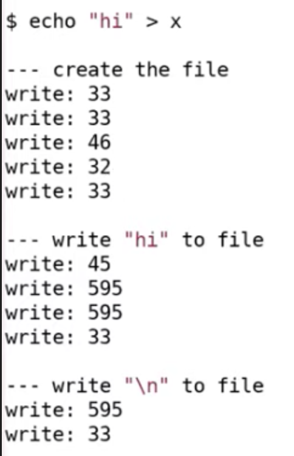
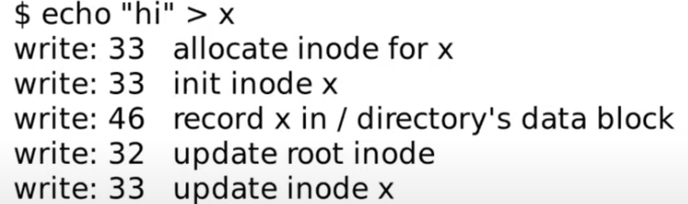
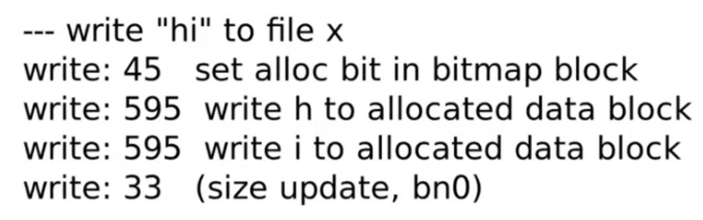

- [Introduction](#introduction)
  - [一些系统调用](#一些系统调用)
- [OS organization and system calls](#os-organization-and-system-calls)
  - [isolation](#isolation)
  - [user kernel mode switch](#user-kernel-mode-switch)
- [Lec04 Page tables](#lec04-page-tables)
  - [Page table](#page-table)
  - [页表缓存（Translation Lookaside Buffer）](#页表缓存translation-lookaside-buffer)
  - [Kernel Page Table](#kernel-page-table)
  - [Code](#code)
- [Lec05 Calling conventions and stack frames RISC-V (TA)(感觉没啥用这一节)](#lec05-calling-conventions-and-stack-frames-risc-v-ta感觉没啥用这一节)
  - [Stack](#stack)
- [Lec06 Isolation \& system call entry/exit (Robert)](#lec06-isolation--system-call-entryexit-robert)
  - [Trap机制](#trap机制)
  - [syscall Trap代码执行流程](#syscall-trap代码执行流程)
  - [Traps from kernel space](#traps-from-kernel-space)
- [Page faults](#page-faults)
  - [Page Faults Basics](#page-faults-basics)
  - [Lazy Page allocation](#lazy-page-allocation)
  - [Zero Fill On Demand](#zero-fill-on-demand)
  - [Copy on Write Fork](#copy-on-write-fork)
  - [Demand Paging](#demand-paging)
  - [Memory Mapped Files](#memory-mapped-files)
- [Interrupts](#interrupts)
  - [Hardware interrupts](#hardware-interrupts)
  - [Device driver](#device-driver)
  - [在xv6中设置中断](#在xv6中设置中断)
  - [UART驱动的top部分](#uart驱动的top部分)
  - [UART驱动的buttom部分](#uart驱动的buttom部分)
  - [中断相关的并发](#中断相关的并发)
  - [UART读取键盘输入](#uart读取键盘输入)
  - [interrupt的演进](#interrupt的演进)
- [Multiprocessors and locking](#multiprocessors-and-locking)
  - [锁的特性和死锁](#锁的特性和死锁)
  - [xv6的自旋锁](#xv6的自旋锁)
- [Thread switching](#thread-switching)
  - [xv6的线程调度](#xv6的线程调度)
  - [xv6进程切换](#xv6进程切换)
  - [code: 定时中断导致的线程切换流程](#code-定时中断导致的线程切换流程)
- [Sleep and Wakeup](#sleep-and-wakeup)
  - [线程切换中的锁](#线程切换中的锁)
  - [sleep and wakeup as well as lost wakeup](#sleep-and-wakeup-as-well-as-lost-wakeup)
  - [Code: sleep() and wakeup()](#code-sleep-and-wakeup)
  - [Code: wait, exit and kill](#code-wait-exit-and-kill)
    - [wait](#wait)
    - [exit](#exit)
    - [kill](#kill)
  - [init进程](#init进程)
  - [real world](#real-world)
    - [调度策略](#调度策略)
    - [sleep and wakeup](#sleep-and-wakeup-1)
    - [kill](#kill-1)
- [File systems](#file-systems)
  - [Overview](#overview)
  - [How file system users disk](#how-file-system-users-disk)
  - [inode](#inode)
    - [磁盘上的inode(kernel/fs.h: struct dinode)](#磁盘上的inodekernelfsh-struct-dinode)
    - [内存中的inode(kernel/file.h: struct inode)](#内存中的inodekernelfileh-struct-inode)
  - [目录](#目录)
  - [file system example](#file-system-example)
  - [code：inode](#codeinode)
  - [Buffer cache](#buffer-cache)
  - [sleep lock](#sleep-lock)
  - [code: pathname](#code-pathname)
- [File system crash（logging）](#file-system-crashlogging)
  - [file system crash example](#file-system-crash-example)
  - [logging](#logging)
  - [code：log\_write()，end\_op()](#codelog_writeend_op)
    - [log\_write()](#log_write)
    - [end\_op()](#end_op)
  - [File system recovering](#file-system-recovering)
  - [log写磁盘流程](#log写磁盘流程)
  - [challenges](#challenges)
    - [cache eviction](#cache-eviction)
    - [log size](#log-size)
    - [并发问题](#并发问题)

# Introduction

OS的目标：

- Abstract, 硬件抽象。为硬件编写一些高层次的接口和抽象。
- multiplex, 在多个应用程序之间复用硬件资源。
- isolation, 隔离
- Sharing, 数据共享，例如编辑器编辑文件但是编译器可以读取。
- security, 权限控制，例如公共计算机，不想要其他用户看到你的文件。
- performance, 性能。OS至少应该不阻止应用获得高性能，甚至帮助应用获得高性能。
- range of uses, OS能够支持大量不同的用户场景。

## 一些系统调用

fork：父进程返回子进程pid，子进程返回0

exec：出错才返回。保留当前的文件描述符表单。

# OS organization and system calls

## isolation

应用程序之间、应用程序和内核之间都要有强隔离。

使用操作系统的主要原因就是为了实现multiplexing and 内存隔离。

硬件需要支持强隔离，一是user/kernel mode，而是虚拟内存。在用户空间只能执行普通指令，特权指令需要在内核态。处理器有一个bit位来判断是什么模式。实际上cpu还有mochine mode

## user kernel mode switch

ECALL指令将控制权从应用程序转移到内核。他接受一个参数，就是syscall的编号，触发一个软中断，然后查询中断向量表，跳转到对应的中断处理程序。

# Lec04 Page tables

## Page table

内存管理单元（MMU，，emory Management Unit）将虚拟地址（virtual address简称va）翻译为物理内存（简称pa）。mmu有表单，保存在内存中，mmu访问内存完成翻译。

不为每一个地址创建一个表单条目，而是为每个页创建一个表单，每次翻译针对一个page，xv6中规定一个页4096字节，也就是2^12字节。

xv6的page table分为三级页表，虚拟地址39位，低12位是offset，对应page大小，实际上用来索引在page中的位置。中间的27位是三级index，剩下的高25位无效。使用高9位索引第一级page directory，directory的一个条目成为PTE(page table entry)，9位用来索引，因此一个directory page有512个条目。每个pte共使用54bits，低10bits是flag，44bits的物理页号（ppn）。高级page directory中的ppn指向低级page directory，最低一级的ppn加上va的offset构成pa。

使用三级页表的好处是节省空间，如果一个进程只是用了一个page，如果不使用三级页表，就需要2^27个pte，现在，只需要1级页表，第0个pte指向二级，二级第0个指向三级，共3*512个条目。

最高级的表单的地址存储在satp寄存器中，切换进程时需要切换satp中的内容，每个进程对应的satp由内核保存。

高级page directory中的44bits ppn，低12bits填0，得到下一级page directory的物理地址。最后一级加上offset得到pa。

每个pte低10bits是flags，包括V，是否有效，如上述例子只使用1个page，那么第一级页表的第0个pte的v置为1其他为0。其他还有r、w、u等。**注意，这些flag声明的是对应的page的权限，而不是pte自己的**

如果pte指向物理地址，那么v和其他权限为如r、w、x等会被设置，指向下一级只设置v。因此可以使用 `if ((pte & (PTE_R | PTE_W | PTE_X)) == 0)`判断是否是最后一级页表。

## 页表缓存（Translation Lookaside Buffer）

加载存储数据需要三次访问内存，速度较慢，因此有TLB。第一次访问得到va到pa的映射后存储在tlb中。切换进程需要切换page table，os告诉cpu，tlb不能用了。

## Kernel Page Table

xv6中，在完成了虚拟到物理地址的翻译之后，如果得到的物理地址大于0x80000000会走向DRAM芯片，如果得到的物理地址低于0x80000000会走向不同的I/O设备。地址0x1000是boot ROM的物理地址，当你对主板上电，主板做的第一件事情就是运行存储在boot ROM中的代码，当boot完成之后，会跳转到地址0x80000000，操作系统需要确保那个地址有一些数据能够接着启动操作系统。cpu中有一个多路选择器来选择指令是走内存还是哪个硬件。

内核的虚拟地址，xv6采用直接映射，即va和pa相同。kernel stack在va中很靠后，在它下面有未映射的Guard page，对应的flag v未设置，防止stack越界，越界报错。kernel stack被映射了两次，在靠后的虚拟地址映射了一次，在PHYSTOP下的Kernel data中又映射了一次，但是实际使用的时候用的是上面的部分，因为有Guard page会更加安全。


每个进程有一个对应的stack。XV6使用这段free memory来存放用户进程的page table，text和data。如果我们运行了非常多的用户进程，某个时间点我们会耗尽这段内存，这个时候fork或者exec会返回错误。当kernel创建了一个进程，针对这个进程的page table也会从Free memory中分配出来。内核会为用户进程的page table分配几个page，并填入PTE。在某个时间点，当内核运行了这个进程，内核会将进程的根page table的地址加载到SATP中。从那个时间点开始，处理器会使用内核为那个进程构建的虚拟地址空间。
本质上来说the size of kernel va space is same as user's.

## Code

查看main函数，调用的一个函数是kvminit，这个函数会设置好kernel的地址空间。
之后，kvminit函数返回了，在main函数中，我们运行到了kvminithart函数。

```c
void
kvminithart()
{
  w_satp(MAKE_SATP(kernel_pagetable));
  sfence_vma();
}
```

设置了SATP寄存器，kernel_pagetable变量来自于kvminit第一行。所以这里实际上是内核告诉MMU来使用刚刚设置好的page table。在这条指令之前，还不存在可用的page table，所以也就不存在地址翻译。执行完这条指令之后，程序计数器（Program Counter）增加了4。而之后的下一条指令被执行时，程序计数器会被内存中的page table翻译。

# Lec05 Calling conventions and stack frames RISC-V (TA)(感觉没啥用这一节)

## Stack


每一次我们调用一个函数，函数都会为自己创建一个Stack Frame，并且只给自己用。函数通过移动Stack Pointer来完成Stack Frame的空间分配。对于Stack来说，是从高地址开始向低地址使用。所以栈总是向下增长

一个函数的Stack Frame包含了保存的寄存器，本地变量，并且，如果函数的参数多于8个，额外的参数会出现在Stack中。因此Stack Frame不是一样大的，但是可以确定，开始的一定是return address和to prev. Framp。

有关StackFrame有两个寄存器，一个SP，一个Fp。Sp指向现在的栈帧位置，Fp指向当前栈帧的顶部（用于访问return address and pre framp）。

# Lec06 Isolation & system call entry/exit (Robert)

## Trap机制

用户空间和内核空间切换叫trap。共三种：

- 用户程序系统调用。
- 程序发生异常，如缺页、除0.
- 设备中断需要内核驱动程序。

重点是用户的32个寄存器。其中包括一些很有趣的register，这些寄存器表明系统调用执行时的系统状态。

- 在硬件中还有一个寄存器叫做程序计数器（Program Counter Register）。
- 表明当前mode的标志位，这个标志位表明了当前是supervisor mode还是user mode。
- 还有一堆控制CPU工作方式的寄存器，比如SATP（Supervisor Address Translation and Protection）寄存器，它包含了指向page table的物理内存地址。
- 还有一些对于今天讨论非常重要的寄存器，比如STVEC（Supervisor Trap Vector Base Address Register）寄存器，它指向了内核中处理trap的指令的起始地址。
- stvec：trap handler的地址，由kernel写入
- sepc：保存trap发生时的现场program counter，因为接下来pc要被取代为stvec。sret是从trap回到现场的指令，将sepc写回到pc
- scause：一个trap产生的原因代码，由CPU写入
- sscratch：放在trap handler的最开始处
- sstatus：控制设备中断是否被开启，如果sstatus中的SIE位被清除，则RISC-V将推迟设备中断。SPP位指示这个trap是在user space中产生的还是在kernel space产生的，并将控制sret回到什么模式
- 以上寄存器只在supervisor模式下发生的trap被使用

当发生除了计时器中断以外的其他类型的trap时，RISC-V将执行以下步骤：

- 如果trap是一个设备产生的中断，而SIE又被清除的情况下，不做下方的任何动作
- 清除SIE来disable一切中断
- 把pc复制到sepc
- 把当前的模式(user / supervisor)保存到SPP
- 设置scause寄存器来指示产生trap的原因
- 将当前的模式设置为supervisor
- 将stvec的值复制到pc
- 开始执行pc指向的trap handler的代码
  注意CPU并没有切换到kernel页表，也没有切换到kernel栈

trap执行时我们需要更改一些cpu状态，大致流程如下：

- 首先，我们需要保存32个用户寄存器。我们希望执行完trap能恢复到用户程序，并且用户程序无感。
- 保存pc
- 修改mode为supervisor，因为我们需要特权指令。
- 将SATP从用户页表指向内核页表。
- 我们需要将堆栈寄存器指向位于内核的一个地址，因为我们需要一个堆栈来调用内核的C函数。

从用户mode到内核，其实增加的权限不多，大概有以下两点：

- 读写SATP寄存器，也就是page table的指针；STVEC，也就是处理trap的内核指令地址；SEPC，保存当发生trap时的程序计数器；SSCRATCH等等。在supervisor mode你可以读写这些寄存器，而用户代码不能做这样的操作。
- 可以使用PTE_U标志位为0的PTE。1的不能访问。

## syscall Trap代码执行流程

以shell中执行write为例。在shell看来只是调用了函数write。

1. shell调用write时，调用的是关联的库函数，(在usys.S),在这个库函数中，先将调用的syscall的号(syscall.h定义)写入a7，执行ECALL指令进行syscall，切换到内核态，执行完后执行ret返回用户态。
2. 执行第一个函数是uservec(trampoline.S)
3. 在汇编函数中跳转到usertrap中(trap.c)
4. 在trap.c中执行了syscall函数。这个函数在表单中找到sys_write函数并执行，执行完后返回到syscall。
5. 调用一个函数叫做usertrapret(trap.c)
6. 调用userset(trampoline.S),在这个函数调用汇编指令返回用户空间。

当user space中发生trap时，会将stvec的值复制到pc，而此时stvec的值是trampoline.S中的uservec，因此跳转到uservec，先保存一些现场的寄存器，恢复kernel栈指针、kernel page table到satp寄存器，再跳转到usertrap(kernel/trap.c)trap handler，然后返回usertrapret(kernel/trap.c)，跳回到kernel/trampoline.S，最后用userret(kernel/trampoline.S)通过sret跳回到user space

RISC-V在trap中不会改变页表，因此user page table必须有对uservec的mapping，uservec是stvec指向的trap vector instruction。uservec要切换satp到kernel页表，同时kernel页表中也要有和user页表中对uservec相同的映射。RISC-V将uservec保存在trampoline页中，并将TRAMPOLINE放在kernel页表和user页表的相同位置处(MAXVA)

当uservec开始时所有的32个寄存器都是trap前代码的值，但是uservec需要对某些寄存器进行修改来设置satp，可以用sscratch和a0的值进行交换，交换之前的sscratch中是指向user process的trapframe的地址，trapframe中预留了保存所有32个寄存器的空间。p->trapframe保存了每个进程的TRAPFRAME的物理空间从而让kernel页表也可以访问该进程的trapframe

当交换完a0和sscratch之后，uservec可以通过a0把所有当前寄存器的值保存到trapframe中。由于当前进程的trapframe已经保存了当前进程的kernel stack、当前CPU的hartid、usertrap的地址、kernel page table的地址等，uservec需要获取这些值，然后切换到kernel pagetable，调用usertrap

usertrap主要是判断trap产生的原因并进行处理，然后返回。因为当前已经在kernel里了，所以这时候如果再发生trap，应该交给kernelvec处理，因此要把stvec切换为kernelvec。如果trap是一个system call，那么syscall将被调用，如果是设备中断，调用devintr，否则就是一个exception，kernel将杀死这个出现错误的进程

回到user space的第一步是调用usertrapret()，这个函数将把stvec指向uservec，从而当回到user space再出现trap的时候可以跳转到uservec，同时设置p->trapframe的一些值为下一次trap作准备，比如设置p->trapframe->kernel_sp = p->kstack + PGSIZE。清除SPP为从而使得调用sret后能够回到user mode。设置回到user space后的program counter为p->trapframe->epc，最后调用跳转到TRAMPOLINE页上的userret回到trampoline.S，加载user page table。userret被userrapret调用返回时a0寄存器中保存了TRAPFRAME，因此可以通过这个TRAPFRAME地址来恢复之前所有寄存器的值(包括a0)，最后把TRAPFRAME保存在sscratch中，用sret回到user space

具体详细步骤看课程。

## Traps from kernel space

当执行kernel code发生CPU trap的时候，stvec是指向kernelvec的汇编代码的。kernelvec将寄存器的值保存在被中断的kernel thread的栈里而不是trapframe里，这样当trap需要切换kernel thread时，再切回来之后还可以从原先的thread栈里找到之前的寄存器值。

保存完寄存器之后，跳转到kerneltrap这个trap handler。kerneltrap可以对设备中断和exception这两种trap进行处理。如果是设备中断，调用devintr进行处理，如果是exception就panic，如果是因为计时器中断，就调用yield让其他kernel thread运行

最后返回到kernelvec中，kernelvec将保存的寄存器值从堆栈中弹出，执行sret，将sepc复制到pc来执行之前被打断的kernel code

# Page faults

## Page Faults Basics

当试图访问PTE_V为0的虚拟地址或user访问PTE_U为0/kernel访问PTE_U为1以及其他违反PTE_W/PTE_R等flag的情况下会出现page faults。Page faults是一个exception，总共有3种page faults：

- load page faults：当load instruction无法翻译虚拟地址时发生
- store page faults：当store instruction无法翻译虚拟地址时发生
- instruction page faults：当一个instruction的地址无法翻译时发生

在xv6中对于exception一律都会将这个进程kill掉，但是实际上可以结合page faults实现一些功能：

- 可以实现copy-on-write fork。在fork时，一般都是将父进程的所有user memory复制到子进程中，但是fork之后一般会直接进行exec，这就会导致复制过来的user memory又被放弃掉。因此改进的思路是：子进程和父进程共享一个物理内存，但是mapping时将PTE_W置零，只有当子进程或者父进程的其中一个进程需要向这个地址写入时产生page fault，此时才会进行copy
- 可以实现lazy allocation。旧的sbrk()申请分配内存，但是申请的这些内存进程很可能不会全部用到，因此改进方案为：当进程调用sbrk()时，将修改p->sz，但是并不实际分配内存，并且将PTE_V置0。当在试图访问这些新的地址时发生page fault再进行物理内存的分配
- paging from disk：当内存没有足够的物理空间时，可以先将数据存储在其他的存储介质（比如硬盘）上，，将该地址的PTE设置为invalid，使其成为一个evicted page。当需要读或者写这个PTE时，产生Page fault，然后在内存上分配一个物理地址，将这个硬盘上的evicted page的内容写入到该内存上，设置PTE为valid并且引用到这个内存物理地址

我们主要关心三个信息当发生了page fault:

- 引起page fault的虚拟地址，或者是触发page fault的源，存放在stval寄存器
- 引起page fault的原因，存放在scause寄存器。该寄存器保存的是trap机制中进入supervisor mode的原因，而page fault使用同样的trap机制。
- 引起page fault时的pc，方便处理完page fault之后重新执行指令。

## Lazy Page allocation

进程调用sbrk()时，修改p->sz但是不分配内存，并且将PTE_V置0，在kernel/trap.c中的usertrap()中处理。
我们通过判断出错的虚拟地址在(stval寄存器)是否小于p->sz(now p->sz has been modified),如果小于说明需要分配内存，否则是错误地址。即下图中的stack地址。

相比于eager allocation, lazy allocation将分配内存放在了实际需要用到时，但是这个时候会发生trap，一般是store指令，此时需要从user to kernel，从上一节可以看到，发生trap需要store多次，因此会产生额外的overhead。

## Zero Fill On Demand

用户程序的地址空间中，除了有text和data区，在他们两个上边还有一个bss区，这个bss区用来存放未被初始化或者初始化为0的全局或者静态变量，data用来存放已初始化的全局变量和静态变量。
bss区可能有很多个为0的page，我们可以优化，只分配一个page，set 0，将所有虚拟地址空间的为0的page映射到这个page，程序启动时可以节省很多物理内存的分配。这个物理page应该是只读的。
如果尝试对bss中的一个page进行更改，那么需要重新分配一个物理page，修改pte，可读可写。
有点类似于lazy page allocation, 同样也会有额外的overhead.

## Copy on Write Fork

在fork时，子进程不创建新的page，而是共享父进程的page，但是需要注意的是，出于对隔离性的考虑，我们需要将page都设置为只读，当父进程或者子进程需要写时触发page fault，重新分配一个新的page，copy出错的page，mapping new page to 子进程，将新的和出错的page都设置为可读写。
当发生page fault时如何判断是 Copy on write呢？需要用到pte中的另一个标志未RSW。
另外，因为父进程和子进程都指向同一个物理page，甚至子进程的子进程仍然指向他，那么在释放的时候需要格外注意重复释放问题。因此需要引入新的元数据信息来存放对物理page的引用计数，当释放一个虚拟page，将计数器-1，计数器为0释放物理page。

## Demand Paging

exec()系统调用，需要重新加载内存并以eager的方式将他们加载到pagetable，但是这是不必要的。我们可以为text等分配好地址段，但是不分配物理page。
程序从地址0开始，在此处发生第一个page fault, 这些page是on-demand page, 我们需要将page对应的程序文件加载进内存，再将内存page映射到page table。
有一种情况，如果二进制文件太大或者data等太大，那么内存不够用，一种选择是撤回page(evict page), 此时使用LRU算法撤回，diary标志，我们撤回non-diary page，以及access位，未被访问的page会被直接撤回。

## Memory Mapped Files

将完整或者部分文件加载到内存中，这样就可以通过load、store操作文件。
操作系统提供mmap(va, len, protection, flags, fd, offset)系统调用, prot是write/read，flags表示进程独享还是共享。内核将从offset位置开始的文件读入内存，修改文件后使用unmap将diary blocks写回。
使用lazy机制，先记录这个PTE属于这个文件描述符。相应的信息通常在VMA结构体中保存，VMA全称是Virtual Memory Area。例如对于这里的文件f，会有一个VMA，在VMA中会记录文件描述符，偏移量等等，这些信息用来表示对应的内存虚拟地址的实际内容在哪，当我们得到一个位于VMA地址范围的page fault时，内核可以从磁盘中读数据，并加载到内存中。

# Interrupts

## Hardware interrupts

中断对应的场景简单来说就是硬件希望得到OS的关注。

与之前的trap ，syscall类似，OS对中断的处理过程也是三步：保存现场，处理，恢复。
但是中断有三点不同：

1. asynchronous：(异步)，当硬件生成中断时，Interrupt handler与当前运行的进程在CPU上没有任何关联。但如果是系统调用的话，系统调用发生在运行进程的context下。
2. concurrency(并发)：对于中断来说，CPU和生成中断的设备是并行的在运行。网卡自己独立的处理来自网络的packet，然后在某个时间点产生中断，但是同时，CPU也在运行。所以我们在CPU和设备之间是真正的并行的，我们必须管理这里的并行。
3. program device：这节课主要关注外部设备，例如网卡，UART，而这些设备需要被编程。每个设备都有一个编程手册，设备的编程手册包含了它有什么样的寄存器，它能执行什么样的操作，在读写控制寄存器的时候，设备会如何响应。不过通常来说，设备的手册不如RISC-V的手册清晰，这会使得对于设备的编程会更加复杂

硬件映射到内核的地址空间，可以类似于内存的读写对硬件进行program。

处理器通过Platform Level Interrupt Control，简称PLIC来处理设备中断。

左上角表示我们有53个中断，中断到达PLIC后，PLIC会路由这些中断到CPU core，如果所有的CPU核都正在处理中断，PLIC会保留中断直到有一个CPU核可以用来处理中断。所以PLIC需要保存一些内部数据来跟踪中断的状态。

- PLIC会通知当前有一个待处理的中断
- 其中一个CPU核会Claim接收中断，这样PLIC就不会把中断发给其他的CPU处理
- CPU核处理完中断之后，CPU会通知PLIC
- PLIC将不再保存中断的信息

## Device driver

大部分驱动分为bottom/top两部分。

- bottom部分通常是Interrupt handler。当一个中断送到了CPU，并且CPU设置接收这个中断，CPU会调用相应的Interrupt handler。Interrupt handler并不运行在任何特定进程的context中，它只是处理中断。
- top部分，是用户进程，或者内核的其他部分调用的接口。对于UART来说，这里有read/write接口，这些接口可以被更高层级的代码调用。

通常情况下，驱动中会有一些队列（或者说buffer），top部分的代码会从队列中读写数据，而Interrupt handler（bottom部分）同时也会向队列中读写数据。这里的队列可以将并行运行的设备和CPU解耦开来

## 在xv6中设置中断

对于“$ ”来说，设备会将字符传输给UART的寄存器，UAR在发送完字符之后产生一个中断。在QEMU中，模拟的线路的另一端会有另一个UART芯片（模拟的），这个UART芯片连接到了虚拟的Console，它会进一步将“$ ”显示在console上。

键盘连接到了UART的输入线路，当你在键盘上按下一个按键，UART芯片会将按键字符通过串口线发送到另一端的UART芯片。另一端的UART芯片先将数据bit合并成一个Byte，之后再产生一个中断，并告诉处理器说这里有一个来自于键盘的字符。之后Interrupt handler会处理来自于UART的字符。

RICSV有很多关于中断的寄存器：

- SIE（Supervisor Interrupt Enable）寄存器。这个寄存器中有一个bit（E）专门针对例如UART的外部设备的中断；有一个bit（S）专门针对软件中断，软件中断可能由一个CPU核触发给另一个CPU核；还有一个bit（T）专门针对定时器中断。
- SSTATUS（Supervisor Status）寄存器。这个寄存器中有一个bit来打开或者关闭中断。（所有中断）
- SIP（Supervisor Interrupt Pending）寄存器。中断的类型。

start.c将所有的中断都设置在Supervisor mode，然后设置SIE寄存器来接收External，软件和定时器中断，之后初始化定时器。

main函数：
第一个外设是console, consoleinti()->uartinit()
uart可以生成中断，但是CPU还不能感知，此时设置PLIC, main()调用plicinit(),然后调用pilcinithart。
PLIC可以路由中断，但是CPU自己还没有设置好中断，main()最后调用scheduler(), scheduler()调用intr_on(), intr_on()设置SSTATUS打开中断标志位。

## UART驱动的top部分

从Shell程序输出提示符“$”到Console流程：

init.c-main(): 首先这个进程的main函数通过mknod操作创建了一个代表Console的设备。因为这是第一个打开的文件，所以这里的文件描述符0。之后通过dup创建stdout和stderr。这里实际上通过复制文件描述符0，得到了另外两个文件描述符1，2。最终文件描述符0，1，2都用来代表Console。

sh.c: Shell程序首先打开文件描述符0，1，2。之后Shell向文件描述符2打印提示符“$ ”。尽管Console背后是UART设备，但是从应用程序来看，它就像是一个普通的文件。Shell程序只是向文件描述符2写了数据，它并不知道文件描述符2对应的是什么。

fprintf工作流程：
user/printf.c->write()->sysfile.c:sys_write()->file.c:filewrite(), filewrite()检查fd类型，这里是设备所以->console.c:consolewrite(), either_copyin拷入字符，然后uartputc(c)将字符写给设备。因此可以认为consolewrite是UART驱动的top部分。->uart.c:uartputc(), 一个环形队列->uartstart():通知设备执行操作。如果设备空闲的话，从buffer中读出数据，然后将数据写入到THR（Transmission Holding Register）发送寄存器。这里相当于告诉设备，我这里有一个字节需要你来发送。一旦数据送到了设备，系统调用会返回，用户应用程序Shell就可以继续执行。这里从内核返回到用户空间的机制与lec06的trap机制是一样的。

## UART驱动的buttom部分

假设键盘生成了一个中断并且发向了PLIC，PLIC会将中断路由给一个特定的CPU核，并且如果这个CPU核设置了SIE寄存器的E bit那么：

- 清除SIE寄存器相应的bit，阻止CPU核被其他中断打扰，该CPU核可以专心处理当前中断。处理完成之后，恢复SIE寄存器相应的bit。
- 设置SEPC寄存器为当前的程序计数器。假设Shell正在用户空间运行，突然来了一个中断，那么当前Shell的程序计数器会被保存。
- 之后，要保存当前的mode。在我们的例子里面，因为当前运行的是Shell程序，所以会记录user mode。
- 将mode设置为Supervisor mode。
- 将程序计数器的值设置成STVEC的值。（注，STVEC用来保存trap处理程序的地址，详见lec06）在XV6中，STVEC保存的要么是uservec或者kernelvec函数的地址，具体取决于发生中断时程序运行是在用户空间还是内核空间。在我们的例子中，Shell运行在用户空间，所以STVEC保存的是uservec函数的地址。可以知道uservec函数会调用usertrap函数。所以最终，我们在usertrap函数中。

trap.c: usertrap()->devintr()->plic_claim() get中断号，uartintr()->如果是从键盘输入的中断，call uartgetc()得到输入字符->uartstart()

## 中断相关的并发

- 设备与CPU是并行运行的。例如当UART向Console发送字符的时候，CPU会返回执行Shell，而Shell可能会再执行一次系统调用，向buffer中写入另一个字符，这些都是在并行的执行。这里的并行称为producer-consumer并行。
- 中断会停止当前运行的程序。例如，Shell正在运行第212个指令，突然来了个中断，Shell的执行会立即停止。对于用户空间代码，这并不是一个大的问题，因为当我们从中断中返回时，我们会恢复用户空间代码，并继续执行执行停止的指令。但是当内核被中断打断时，事情就不一样了。所以，代码运行在kernel mode也会被中断，这意味着即使是内核代码，也不是直接串行运行的。在两个内核指令之间，取决于中断是否打开，可能会被中断打断执行。对于一些代码来说，如果不能在执行期间被中断，这时内核需要临时关闭中断，来确保这段代码的原子性。
- 驱动的top和bottom部分是并行运行的。例如，Shell会在传输完提示符“$”之后再调用write系统调用传输空格字符，代码会走到UART驱动的top部分（注，uartputc函数），将空格写入到buffer中。但是同时在另一个CPU核，可能会收到来自于UART的中断，进而执行UART驱动的bottom部分，查看相同的buffer。所以一个驱动的top和bottom部分可以并行的在不同的CPU上运行。这里我们通过lock来管理并行。因为这里有共享的数据，我们想要buffer在一个时间只被一个CPU核所操作。

## UART读取键盘输入

consoleread函数，也有一个buffer，包含了128个字符。其他的基本一样，也有producer和consumser。但是在这个场景下Shell变成了consumser，因为Shell是从buffer中读取数据。而键盘是producer，它将数据写入到buffer中。Shell在打印完“$ ”之后，如果键盘没有输入，Shell进程会sleep，直到键盘有一个字符输入。所以在某个时间点，假设用户通过键盘输入了“l”，这会导致“l”被发送到主板上的UART芯片，产生中断之后再被PLIC路由到某个CPU核，之后会触发devintr函数，devintr可以发现这是一个UART中断，然后通过uartgetc函数获取到相应的字符，之后再将字符传递给consoleintr函数。默认情况下，字符会通过consputc，输出到console上给用户查看。之后，字符被存放在buffer中。在遇到换行符的时候，唤醒之前sleep的进程，也就是Shell，再从buffer中将数据读出。

## interrupt的演进

中断需要很多步骤，对于cpu来说如果外设数据很多那么cpu处理不过来，所以需要外设自己做很多事情。
如现代网卡的NAPI，在polling和Interrupt之间动态切换。
polling：cpu轮询读取设备的寄存器。

# Multiprocessors and locking

## 锁的特性和死锁

- 锁可以避免丢失更新。如果你回想我们之前在kalloc.c中的例子，丢失更新是指我们丢失了对于某个内存page在kfree函数中的更新。如果没有锁，在出现race condition的时候，内存page不会被加到freelist中。但是加上锁之后，我们就不会丢失这里的更新。
- 锁可以打包多个操作，使它们具有原子性。我们之前介绍了加锁解锁之间的区域是critical section，在critical section的所有操作会都会作为一个原子操作执行。
- 锁可以维护共享数据结构的不变性。共享数据结构如果不被任何进程修改的话是会保持不变的。如果某个进程acquire了锁并且做了一些更新操作，共享数据的不变性暂时会被破坏，但是在release锁之后，数据的不变性又恢复了。你们可以回想一下之前在kfree函数中的freelist数据，所有的free page都在一个单链表上。但是在kfree函数中，这个单链表的head节点会更新。freelist并不太复杂，对于一些更复杂的数据结构可能会更好的帮助你理解锁的作用。

死锁：对锁进行排序。
如果一个模块m1中方法g调用了另一个模块m2中的方法f，那么m1中的方法g需要知道m2的方法f使用了哪些锁。因为如果m2使用了一些锁，那么m1的方法g必须集合f和g中的锁，并形成一个全局的锁的排序。这意味着在m2中的锁必须对m1可见，这样m1才能以恰当的方法调用m2。违背了代码抽象的原则。

## xv6的自旋锁

```c
struct spinlock {
  uint locked;       // Is the lock held?

  // For debugging:
  char *name;        // Name of lock.
  struct cpu *cpu;   // The cpu holding the lock.
};
```

主要是acquire() and release()
如果只是简单的循环判断locked是否为0来进行，例如：

```c
while(1){
  if(lk->locked==0){
    lk->locked=1;
    return;
  }
}
```

问题在于可能会有race condition, 如果有多个进程同时读到locked=0，那么就违背了锁的本意。
解决这个问题的简单方法是依赖于一个特殊的硬件指令，保证一次test-and-set操作的原子性。在RISC-V上，这个特殊的指令就是amoswap（atomic memory swap）。这个指令接收2个参数，分别是address，寄存器r。这条指令会先锁定住address，将address中的数据保存在一个临时变量中（tmp），之后将r中的数据写入到地址中，之后再将保存在临时变量中的数据写入到r1中，最后再对于地址解锁。

c库函数定义的有原子操作，unsigned int __sync_lock_test_and_set_4(volatile void *, unsigned int)接受一个地址和value，将value写入地址，返回地址原来的value。

__sync_synchronize();硬件内存屏障。不允许load和store指令越过自己。编译器或处理器会重排指令优化性能，如果是串行那么没有问题，但是并行会发生灾难。如：

```c
locked=1;
x+=1;
locked=0;
```

如果发生重排，x+=1上移或者下移，在并行情况下可能会发生错误。

release中最后将locked设置为0为什么不直接store 0？
because store is not a 原子操作。

为什么开始时要关掉中断？
spinlock需要处理两类并发，一类是不同CPU之间的并发，一类是相同CPU上中断和普通程序之间的并发。如果不关闭中断，以uart为例，uartputc函数会acquire锁，UART本质上就是传输字符，当UART完成了字符传输会产生一个中断之后会运行uartintr函数，在uartintr函数中，会获取同一把锁，但是这把锁正在被uartputc持有。

push_off() and pop_off() 跟踪当前cpu的锁的嵌套深度。

# Thread switching

线程的状态包含了三个部分：

- pc
- 保存变量的reg
- 程序的stack

## xv6的线程调度

- 如何实现线程间的切换——线程调度，xv6给每个cpu core都创建了一个Scheduler。
- 线程切换时需要保存哪些信息。
- 如何处理运算密集型线程（compute bound thread）——定时器中断

pre-emptive scheduling：pre-emptive的意思是，即使用户代码本身没有出让CPU，定时器中断仍然会将CPU的控制权拿走，并出让给线程调度器。与之相反的是voluntary scheduling。

XV6和其他的操作系统中，线程调度是这么实现的：定时器中断会强制的将CPU控制权从用户进程给到内核，这里是pre-emptive scheduling，之后内核会代表用户进程（注，实际是内核中用户进程对应的内核线程会代表用户进程出让CPU），使用voluntary scheduling。

三种线程状态：

- RUNNING, thread is running on a certain CPU
- RUNABLE, 县城还没有在某个CPU上运行，但是一有空闲CPU就可以运行。
- SLEEPING.

前面的定时器中断就是将RUNNING线程转换成RUNABLE线程，需要从cpu的reg中拷贝状态到内存。

## xv6进程切换

实际上进程切换很多场景不是因为定时器中断，例如系统调用在等待IO等等，只是以定时器中断举例。

简单来说从一个用户进程到另一个用户进程，都需要经历的流程：

1. 从第一个用户进程进入它对应的内核线程，保存用户进程的状态(trapframe)
2. 从第一个用户进程的内核线程切换到第二个用户进程的内核线程
3. 第二个内核线程暂停自己恢复第二个用户进程的用户寄存器。
4. 返回第二个用户进程

前提条件是，第二个用户进程状态时RUNABLE，他的用户空间状态已经保存在trapframe中，对应的内核线程的寄存器等信息也保存在上下文中。

详细来说：

1. 定时器中断强制CPU从user到kernel，trampoline代码将user reg保存到trapframe
2. 在内核运行usertrap，执行中断处理程序。CPU在进程p1的内核线程和内核栈
3. p1的内核线程决定让出CPU，最后会调用swtch()
4. swtch()保存p1对应的内核线程的reg到context。所以user reg在trapframe，kernel reg在context
5. 一个CPU上运行的内核线程可以直接切换的是CPU对应的调度器线程。swtch()恢复之前为cpu的调度器线程保存的reg和stack pointer。之后再调度器线程的context执行schedulder()
6. schedulder()将p1设置为RUNABLE，通过进程表单找到下一个RUNABLE(可能还是p1)p2, schedulder()再次调用swtch()
7. swtch()保存自己的reg到调度器线程的context
8. 找到p2的上下文，恢复他的reg
9. 因为进程P2在进入RUNABLE状态之前，如刚刚介绍的进程P1一样，必然也调用了swtch函数。所以之前的swtch函数会被恢复，并返回到进程P2所在的系统调用或者中断处理程序中（注，因为P2进程之前调用swtch函数必然在系统调用或者中断处理程序中）。
10. 恢复用户进程p2

内核现成的context保存在用户进程对应的proc structural，调度器线程的context保存在cpu structural。气质可以将context内容保存在任意一个与进程一一对应的结构体。

一个cpu core同一时间只会运行一个线程，要么用户进程的线程，要么对应的内核线程，要么cpu对应的调度器线程。同样一个进程同一时间只会运行在一个cpu core

## code: 定时中断导致的线程切换流程

定时器发生中断，kernel/trap.c devintr() return 2, call yield().

```c
void
yield(void)
{
  struct proc *p = myproc();
  acquire(&p->lock);
  p->state = RUNNABLE;
  sched();
  release(&p->lock);
}
```

修改进程状态，但是其实这个进程正在内核线程运行。所以加上锁，确保其他cpu不会识别到这个进程的状态变为runable并尝试运行它。

sched():  主要是后边的call swtch()：`swtch(&p->context, &mycpu()->context);`

swtch(): 将当前内核线程的reg保存到p->context，恢复CPU核的调度器线程的reg。mucpu()->context的ra（当前函数的返回地址）是scheduler()。swtch()主要就是store和load指令，最后返回。返回到scheduler的24行。

这里pc并不是有效信息，上下文切换永远发生在函数调用边界，恢复执行其实就是swtch()的返回，因此我们关心的是swtch返回从调用地址继续执行，所以需要的是ra。这里我们只恢复了14个寄存器，因为这是callee saved register，caller保存的会在调用swtch时的c代码的栈保存。而trap可能发生在任何地方，因此我们需要pc来定位。

scheduler():

```c
void
scheduler(void)
{
  struct proc *p;
  struct cpu *c = mycpu();
  
  c->proc = 0;
  for(;;){
    // Avoid deadlock by ensuring that devices can interrupt.
    intr_on();

    for(p = proc; p < &proc[NPROC]; p++) {
      acquire(&p->lock);
      if(p->state == RUNNABLE) {
        // Switch to chosen process.  It is the process's job
        // to release its lock and then reacquire it
        // before jumping back to us.
        p->state = RUNNING;
        c->proc = p;
        swtch(&c->context, &p->context);

        // Process is done running for now.
        // It should have changed its p->state before coming back.
        c->proc = 0;
      }
      release(&p->lock);
    }
  }
}
```

现在我们正运行在CPU拥有的调度器线程中，并且我们正好在之前调用swtch函数的返回状态。之前调度器线程调用switch是因为想要运行pid为3的进程，也就是刚刚被中断的spin程序。

虽然pid为3的spin进程也调用了swtch函数，但是那个switch并不是当前返回的这个switch。spin进程调用的swtch函数还没有返回，而是保存在了pid为3的栈和context对象中。现在返回的是之前调度器线程对于swtch函数的调用。

p->lock: 在yield()使用，保证设置进程状态，保存进程的上下文，停止使用当前进程的栈这三步时原子操作，另一方面，在scheduler(),运行一个进程时，将进程设置为RUNNING，也需要swtch()拷贝上下文，此时如果有中断那么将会是灾难。**另外需要额外注意的是，一个线程的锁，在yield()时获取，切换到scheduler()24行释放，因为调度器线程此时的上下文的p仍然是这个刚被要求换掉的线程。p1上锁，到调度器线程，释放p1，获取p2，到p2的yield，释放p2，获取p2，到调度器释放p2，获取p1到p1的yield释放p1形成闭环**

swtch()返回实际上时返回上一个进程对swtich的调用，这是进程切换的核心。

第一次swtch是在allocproc时，伪造的。

# Sleep and Wakeup

## 线程切换中的锁

1. 一个进程出于某种原因想要进入休眠状态，比如说出让CPU或者等待数据，它会先获取自己的锁；
2. 之后进程将自己的状态从RUNNING设置为RUNNABLE；
3. 之后进程调用switch函数，其实是调用sched函数在sched函数中再调用的switch函数；
4. switch函数将当前的线程切换到调度器线程；
5. 调度器线程之前也调用了switch函数，现在恢复执行会从自己的switch函数返回；
6. 返回之后，调度器线程会释放刚刚出让了CPU的进程的锁

1中acquire锁是因为组织其他cpu core的调度器线程发现该线程是runable并运行他。直到他更改运行状态并停止使用自己的栈再释放锁，也就是在调度器线程中释放。

不允许执行swtch()过程中持有任何其他锁。如果p1持有某个锁，那么他让出cpu后，p2获取锁，此时发生死锁。因为获取锁时会暂停中断，(详见acquire() )，所以即使是定时器中断也不能让p2让出cpu，所以他一直等待获取锁，但是p1又不能运行释放锁。

## sleep and wakeup as well as lost wakeup

考虑生产者消费者模型。

```c
void V(struct semaphore* s) {
    acquire(&s->lock);
    s->count += 1;
    wakeup(s);  // !pay attention
    release(&s->lock);
}

void P(struct semaphore* s) {
    acquire(&s->lock);
    while (s->count == 0)
        sleep(s);  // !pay attention
  
    s->count -= 1;
    release(&s->lock);
}
```

此时虽然可以不一直循环，但是会导致死锁，

```c
void V(struct semaphore* s) {
    acquire(&s->lock);
    s->count += 1;
    wakeup(s);  // !pay attention
    release(&s->lock);
}

void P(struct semaphore* s) {
    acquire(&s->lock);
    while (s->count == 0){
        release(&s->lock);
        sleep(s);  // !pay attention
        acquire(&s->lock);
    }
    s->count -= 1;
    release(&s->lock);
}
```

虽然不会死锁，但是会发生lost wakeup，假设`P`在第10行发现`s->count==0`。当`P`在第11行和第12行之间时，`V`在另一个CPU上运行：它将`s->count`更改为非零，并调用`wakeup`，这样就不会发现进程处于休眠状态，因此不会执行任何操作。现在P继续在第12行执行：它调用`sleep`并进入睡眠。这会导致一个问题：`P`正在休眠，等待调用`V`，而`V`已经被调用。除非我们运气好，生产者再次呼叫`V`，否则消费者将永远等待，即使`count`为非零。

## Code: sleep() and wakeup()

sleep()需要传入channel和条件锁，先获取进程锁，再释放条件锁（顺序不能反）。在调用wakeup()之前，需要先获取条件锁，所以在sleep释放条件锁之前，wakeup甚至不能调用。sleep释放条件锁后，wakeup可以调用。wakeup需要获取进程锁才能查看线程的状态，此时wakeup不能获取。sleep更改线程状态保存channel之后调用sched(), 最终在调度器线程中释放进程锁，wakeup可以查看并修改线程状态。sleep被唤醒后先释放进程锁，再获取条件锁（这里释放的进程锁是在调度器线程中获取的）。

总之，sleep睡眠时不需要知道究竟在等待什么事件，但是需要知道这个条件的锁。

sleep的使用通常放在循环中，这样保证了在多个进程共同使用时（多个消费者）的正确性

## Code: wait, exit and kill

### wait

```c
int
wait(uint64 addr)
{
  struct proc *np;
  int havekids, pid;
  struct proc *p = myproc();

  acquire(&wait_lock);

  for(;;){
    // Scan through table looking for exited children.
    havekids = 0;
    for(np = proc; np < &proc[NPROC]; np++){
      if(np->parent == p){
        // make sure the child isn't still in exit() or swtch().
        acquire(&np->lock);

        havekids = 1;
        if(np->state == ZOMBIE){
          // Found one.
          pid = np->pid;
          if(addr != 0 && copyout(p->pagetable, addr, (char *)&np->xstate,
                                  sizeof(np->xstate)) < 0) {
            release(&np->lock);
            release(&wait_lock);
            return -1;
          }
          freeproc(np);
          release(&np->lock);
          release(&wait_lock);
          return pid;
        }
        release(&np->lock);
      }
    }

    // No point waiting if we don't have any children.
    if(!havekids || p->killed){
      release(&wait_lock);
      return -1;
    }
  
    // Wait for a child to exit.
    sleep(p, &wait_lock);  //DOC: wait-sleep
  }
}
```

wait使用进程锁作为条件锁，exit将进程的状态设置为zombie，wait查找出于zombie的进程，释放资源并复制退出码到提供的地址，并返回子进程pid。找到子进程但是子进程没有退出sleep。注意wait先获取wait_lock锁，再试图获取子进程的锁，因此整个xv6都遵守这个顺序。***wait_lock()是一个全局锁，不归某个进程所有***，因为知道获取这个锁之前，进程都不知道他的父进程是谁。

wait使用np->parent而不获取对应的锁，因为np可能是当前进程的父进程，违反上边的顺序。此时我们需要保证，对共享区数据parent，只能由父进程设置。

wait()调用freeproc释放资源，在freeproc中将进程状态设置为unused

### exit

exit记录退出状态码释放资源，将当前要退出的进程的所有子进程传递给inti进程，在父进程sleep时唤醒，将调用方标记为zombie，并让出cpu。

最后锁的顺序问题，必须先获取wait_lock, 再获取p->lock，因为先父进程的锁再子进程，保持一致。为什么需要wait锁因为它是父进程的条件锁，在wakeup之前必须先获取条件锁。最后p->lock似乎没有释放，其实是在调度器线程中将他释放。

### kill

kill基本不做什么工作，因为要kill的进程可能正在做一些重要的工作，例如修改内核数据。kill只是将进程的killed置为1，在usertrap中的安全位置，调用exit。查看usertrap()可以看到，当进程在用户空间，在下一次系统调用或者中断（定时器或其他）发生，那么进程退出。

但是如果不在用户空间，而是在执行syscall时，例如piperead，如果进程时sleeping，那么进程会退出而不必等到中断。在kill()中会将sleeping的进程状态修改为runable，在piperad中sleep()退出，此时会有检查如果进程killed被设置就会然后-1到usertrap() syscall处。

也有一些例外，我们希望这个进程完成这个系统调用，例如对文件的操作，那么在while循环中可能不会检查killed。

## init进程

在user/init.c中，fork了一个进程，并循环wait。如果init进程退出，将会是一个fatal级别的错误。

## real world

### 调度策略

xv6的调度器实现简单的轮询调度(round robin)，真实的操作系统有更复杂的策略，如优先级。优先级可能导致意外的交互，例如优先级反转(priority inversion)和航队(convoys)，一个低优先级持有共享锁导致高优先级等待，许多高优先级等待形成航队，可能持续很久。

### sleep and wakeup

原始unix内核sleep只是禁用了中断，因为是单核。Linux的sleep使用一个显示的队列，成为等待队列，而不是等待通道，等待队列内部有自己的锁。

wakeup扫描整个进程找到匹配chan进程效率低下，好的方法是适用于给structural替换chan，该结构体包含在其上休眠的进程列表，例如Linux的等待队列。一些线程库引用与条件变量相同的结构体，sleep和wakeup称为wait和signal。但不管怎么样，所有的机制共同点是sleep条件收到某种睡眠过程中原子级释放的锁的保护。

xv6中wakeup会唤醒所有等待通道的进程，他们竞相检查睡眠条件（while的判断），成为惊群效应(thundering herd)，最好避免，所以一般的os会有两个唤醒原语，signal唤醒一个，broadcast唤醒所有。

### kill

xv6的kill存在一定问题。sleep和kill可能存在竞争。例如，如果在循环中检查killed之后，sleep之前，kill修改了killed并唤醒进程， 之后进程sleep，那么进程可能会推迟被kill甚至永不醒来。

# File systems

## Overview

文件系统维护了一个inode，他代表文件，并且不依赖于文件名，实际上通过编号进行区分。inode有一个link count跟踪指向这个文件的文件名数量。还有一个openfd count，打开的文件描述符数，只有两个count都为0才可以被删除。

由于read and write api has not offset, 所以文件描述符必须自己维护。

文件系统的核心数据结构是inode and fiel descriptor.

文件系统按层理解：

* 最底层的磁盘，保存实际数据的设备，正是这些设备提供了持久化存储。
* 在这之上是buffer cache或者说block cache，这些cache可以避免频繁的读写磁盘。这里我们将磁盘中的数据保存在了内存中。
* 为了保证持久性，再往上通常会有一个logging层。许多文件系统都有某种形式的logging，我们下节课会讨论这部分内容，所以今天我就跳过它的介绍。
* 在logging层之上，XV6有inode cache，这主要是为了同步（synchronization），我们稍后会介绍。inode通常小于一个disk block，所以多个inode通常会打包存储在一个disk block中。为了向单个inode提供同步操作，XV6维护了inode cache。
* 再往上就是inode本身了。它实现了read/write。
* 再往上，就是文件名，和文件描述符操作。

## How file system users disk

- sector通常是磁盘驱动可以读写的最小单元
- block for OS or file system，xv6中是1024

对硬件的抽象屏蔽了HDD和SSD的不同，磁盘驱动通常使用一些标准协议如PCIE与磁盘交互，从文件系统的角度，可以将磁盘看作一个组大的block数组。文件系统的工作是将所有的数据结构以一种能够在重启之后重新构建文件系统的方式存放在磁盘。

xv6的布局：

* block0要么没有用，要么被用作boot sector来启动操作系统。
* block1通常被称为super block，它描述了文件系统。它可能包含磁盘上有多少个block共同构成了文件系统这样的信息。我们之后会看到XV6在里面会存更多的信息，你可以通过block1构造出大部分的文件系统信息。
* 在XV6中，log从block2开始，到block32结束。实际上log的大小可能不同，这里在super block中会定义log就是30个block。
* 接下来在block32到block45之间，XV6存储了inode。我之前说过多个inode会打包存在一个block中，一个inode是64字节。
* 之后是bitmap block，这是我们构建文件系统的默认方法，它只占据一个block。它记录了数据block是否空闲。
* 之后就全是数据block了，数据block存储了文件的内容和目录的内容。

通常来说Bitmap block, inode blocks and log blocks统称为metadata block.他们虽然不存放实际数据，但是存储了能帮助文件系统完成工作的元数据。

## inode

### 磁盘上的inode(kernel/fs.h: struct dinode)

inode是一个64字节的数据结构。

```c
struct dinode {
  short type;           // File type
  short major;          // Major device number (T_DEVICE only)
  short minor;          // Minor device number (T_DEVICE only)
  short nlink;          // Number of links to inode in file system
  uint size;            // Size of file (bytes)
  uint addrs[NDIRECT+1];   // Data block addresses
};
```

* type字段，表明inode是文件还是目录。0表示空闲
* nlink字段，也就是link计数器，用来跟踪究竟有多少文件名指向了当前的inode。
* size字段，表明了文件数据有多少个字节。
* 不同文件系统中的表达方式可能不一样，不过在XV6中接下来是一些block的编号，例如编号0，编号1，等等。XV6的inode中总共有12个block编号。这些被称为direct block number。这12个block编号指向了构成文件的前12个block。举个例子，如果文件只有2个字节，那么只会有一个block编号0，它包含的数字是磁盘上文件前2个字节的block的位置。
* 之后还有一个indirect block number，它对应了磁盘上一个block，这个block包含了256个block number，这256个block number包含了文件的数据。所以inode中block number 0到block number 11都是direct block number，而block number 12保存的indirect block number指向了另一个block。

其实Indirect block就是一个索引，自然可以建立多级索引。

每个编号4字节，一个block 1024字节，因此one block has 256 编号。由于一个编号4字节，所以一个磁盘最大4TB。磁盘一般不止4Tb，编号使用超过32bits。

### 内存中的inode(kernel/file.h: struct inode)

```c
struct inode {
  uint dev;           // Device number
  uint inum;          // Inode number
  int ref;            // Reference count
  struct sleeplock lock; // protects everything below here
  int valid;          // inode has been read from disk?

  short type;         // copy of disk inode
  short major;
  short minor;
  short nlink;
  uint size;
  uint addrs[NDIRECT+1];
};
```

只有内核中由c指针引用某个inode，内存中才会存储这个inode结构体。ref表示指向他的指针数量，变为0后内存抛弃这个inode，iget和iput分别获取和释放指向他的指针，修改ref。

## 目录

目录本质上是一个文件加上一些文件系统可以理解的数据结构。其inode的type为T_DIR, xv6中是每个目录的数据是一系列entris，每个entry有固定格式共16字节：

- 前两个字节包含目录中文件的或子目录的inode编号，inode为0表示空。
- 后14字节包含文件或者子目录名，最多14个字符。

dirlookup(struct inode *dp, char *name, uint *poff)搜索，如果找到返回指向相应inode的指针，设置poff为目录中条目的字节偏移。

dirlink()将给定名称和inode编号的新目录条目写入。

## file system example

启动xv6可以看到调用了makefs指令，包含46个meta block，包括：boot block, super block, 30 log blocks, 13 inode blocks, bitmap block。后边是954个data blocks

输入`echo hi > x`，可以看到分三个阶段：

- 创建文件
- 写入hi
- 写入'\n'



- 第一个33是标记inode将要被使用，xv6使用type 表示是否空闲、文件、目录。(allocate inode for x)
- 第二个33实际写入的内容，包含linkcount为1等（init inode x）
- 46是向第一个data block写数据，这个block属于根目录，因为根目录增加了一个文件，所以需要增加entry(record x in / directory's data block)
- 32：根目录的inode的size，因为根目录的大小变了。(update root inode)
- 33：更新x的inode(update inode x)
- 45：更新bitmap，扫描bitmap找到一个还未使用的data block，未使用对应的bit为0，修改为1.
- 两个595：选择595号block，两个字符写入两次。
- 33：更改文件x的inode中的size

## code：inode

kernel/sysfile.c：sys_open()->create()：解析路径名找到最后一个目录，查看文件是否存在，存在返回错误，不存在->kernel/fs.c: ialloc(): 遍历所有可能的inode，找到对应的block，查看type并设置，调用log_write().

重点看fs.c中的iget、iput和ilock。iget找到某个inode并返回他在内存中的拷贝，但是不从disk读取。ilock锁定给定的inode如果必要从disk读取。iput对ref-1，如果是最后一个那么itable的entry可以被其他inode使用，如果同时nlink也为0那么在disk释放它和他的数据，所以iput必须在事务中使用。

bmap(struct inode* ip, uint bn)返回索引结点ip的第bn个数据块的磁盘块号，如果没有就分配。

itrunc()释放文件的块，先释放直接块，然后间接块，最后间接块本身。

还有readi和writei也需要看。

stati()将inode元数据复制到stat结构体，该结构体通过stat系统调用向用户程序公开

## Buffer cache

功能有两个：

* 同步对磁盘块的访问，以确保磁盘块在内存中只有一个副本，并且一次只有一个内核线程使用该副本
* 缓存常用块，以便不需要从慢速磁盘重新读取它们。代码在***bio.c***中。

Buffer cache层导出的主接口主要是`bread`和`bwrite`；前者获取一个buf，其中包含一个可以在内存中读取或修改的块的副本，后者将修改后的缓冲区写入磁盘上的相应块。内核线程必须通过调用`brelse`释放缓冲区。Buffer cache每个缓冲区使用一个睡眠锁，以确保每个缓冲区（因此也是每个磁盘块）每次只被一个线程使用；`bread`返回一个上锁的缓冲区，`brelse`释放该锁。

使用双向链表，LRU算法。

需要保护的不变量是每个block在buffer cache中只能有一个缓存备份，否则，如果两个inode都使用一个block，自然是同一个block cache，那么第二个写入磁盘会覆盖第一个。

## sleep lock

```c
void
acquiresleep(struct sleeplock *lk)
{
  acquire(&lk->lk);
  while (lk->locked) {
    sleep(lk, &lk->lk);
  }
  lk->locked = 1;
  lk->pid = myproc()->pid;
  release(&lk->lk);
}
```

先获取sleeplock的spinlock，典型的sleep 锁，sleeplock的属性locked是条件，lk属性是条件锁。

不用spinlock原因是磁盘操作时间较长，我们不可能让cpu一直空转等待，而且spinlock不允许中断，那么永远收不到磁盘传来的中断。

## code: pathname

主要是skipelem() and namex()。

skipelem(char *path, char *name):
Examples:
skipelem("a/bb/c", name) = "bb/c", setting name = "a"
skipelem("///a//bb", name) = "bb", setting name = "a"
skipelem("a", name) = "", setting name = "a"
skipelem("", name) = skipelem("////", name) = 0

namex(char *path, int nameiparent, char *name):
主要作用是，如果nameiparent==0，返回path自身的inode，将那么设置为路径最后的那个名字。和上边那个函数一样（就是用它实现的）。如果nameiparent==1，那么返回父目录的inode。

后边利用这个函数实现了namei() and nameiparent(), 作用显然。

重点关注锁的使用，这里不贴代码了。

# File system crash（logging）

## file system crash example



（上一个lec的示例中的create部分。）在33之后46之前crash，那么分配了inode，但是没有记录，自然也无法删除。



（写部分）在45后crash，分配了data block但是没有更新到文件x的inode中，这部分block丢失了。

## logging

- 原子性的系统调用。
- 快速恢复
- 高性能

但是xv6的简单实现实际上性能并不好。

xv6的log结构：最开始有一个header block，也就是commit record，里边包括：

- 数字n表示有效的log block数量
- 每个log block实际对应的编号

之后就是log的数据。

基本思想：

1. 当需要更新文件系统时，并不是更新文件系统本身，而是将数据写入log，并记录对应block号。
2. 文件系统操作结束后，commit所有操作，意味着在log的某个位置记录属于同一文件系统的操作的个数。commit实际上是写header block，单个block或者sector的write是原子的，也就是说，header block中的n要么是0要么是有效的。
3. install log，将log中对应的block写入到真正的block。
4. clean log，写完之后清除log，实际就是将操作的个数设置为0.

发生crash：

- 如果在12之间，那么commit记录为0，什么也不做相当于系统调用write read从未发生。
- 23之间，重新install
- 34之间，重启之后会redo log在恢复期间不能执行任何文件系统的syscall。（install log是幂等的）

文件系统运行时，在内存中也会有一份header block的拷贝，同时block cache中也会有。

## code：log_write()，end_op()

不能再所有写操作完成之前写入commit record。意味着文件系统操作必须标明事物的开始和结束。

xv6中begin_op()和end_op()表示开始和结束。

between begin_op() and end_op() ,磁盘不会有实际改变，也就是数据不会写入实际的数据区。在end_op()，写入log 区再写入commit record。

在begin_op() and end_op()之间的所有bwrite实际都是log_write，

### log_write()

```c
void
log_write(struct buf *b)
{
  int i;

  acquire(&log.lock);
  if (log.lh.n >= LOGSIZE || log.lh.n >= log.size - 1)
    panic("too big a transaction");
  if (log.outstanding < 1)
    panic("log_write outside of trans");

  for (i = 0; i < log.lh.n; i++) {
    if (log.lh.block[i] == b->blockno)   // log absorption
      break;
  }
  log.lh.block[i] = b->blockno;
  if (i == log.lh.n) {  // Add new block to log?
    bpin(b);
    log.lh.n++;
  }
  release(&log.lock);
}

```

log_write()中，我们已经向某个block cache如45写入数据，接下来在内存中记录，先获取log header锁，跟新log header。如果已经被记录则忽略，称为log absorbtion(合并)。因为可能一个块被多次写入，例如包含多个inode的磁盘块，我们只需要将一个副本写入即可(因为所有的操作都在内存中，最后统一写入log)。然后对n+1，call bpin()将block45固定在block cache。

### end_op()

```c
void
end_op(void)
{
  int do_commit = 0;

  acquire(&log.lock);
  log.outstanding -= 1;
  if(log.committing)
    panic("log.committing");
  if(log.outstanding == 0){
    do_commit = 1;
    log.committing = 1;
  } else {
    // begin_op() may be waiting for log space,
    // and decrementing log.outstanding has decreased
    // the amount of reserved space.
    wakeup(&log);
  }
  release(&log.lock);

  if(do_commit){
    // call commit w/o holding locks, since not allowed
    // to sleep with locks.
    commit();
    acquire(&log.lock);
    log.committing = 0;
    wakeup(&log);
    release(&log.lock);
  }
}
```

call commit()

```c
static void
commit()
{
  if (log.lh.n > 0) {
    write_log();     // Write modified blocks from cache to log
    write_head();    // Write header to disk -- the real commit
    install_trans(0); // Now install writes to home locations
    log.lh.n = 0;
    write_head();    // Erase the transaction from the log
  }
}
```

如果在write_head()之前crash，那么相当于没发生过。`log.lh.n`实际上就是clean log

write_log():

```c
static void
write_log(void)
{
  int tail;

  for (tail = 0; tail < log.lh.n; tail++) {
    struct buf *to = bread(log.dev, log.start+tail+1); // log block
    struct buf *from = bread(log.dev, log.lh.block[tail]); // cache block
    memmove(to->data, from->data, BSIZE);
    bwrite(to);  // write the log
    brelse(from);
    brelse(to);
  }
}
```

遍历log中记录的block，读log block到内存，加那个cache block中的写入到log block，然后拷贝到disk的log区。

write_head():

```c
static void
write_head(void)
{
  struct buf *buf = bread(log.dev, log.start);
  struct logheader *hb = (struct logheader *) (buf->data);
  int i;
  hb->n = log.lh.n;
  for (i = 0; i < log.lh.n; i++) {
    hb->block[i] = log.lh.block[i];
  }
  bwrite(buf);
  brelse(buf);
}
```

读取log的header block，将n和所有block编号拷贝到header中，最后写回disk。这里的bwrite()就是commit point，在这之前crash那么什么都不发生，之后就都会恢复。

commit()中的install_trans():

```c
static void
install_trans(int recovering)
{
  int tail;

  for (tail = 0; tail < log.lh.n; tail++) {
    struct buf *lbuf = bread(log.dev, log.start+tail+1); // read log block
    struct buf *dbuf = bread(log.dev, log.lh.block[tail]); // read dst
    memmove(dbuf->data, lbuf->data, BSIZE);  // copy block to dst
    bwrite(dbuf);  // write dst to disk
    if(recovering == 0)
      bunpin(dbuf);
    brelse(lbuf);
    brelse(dbuf);
  }
}
```

很直观，不多说。

## File system recovering

crash之后重启第一件事就是initlog(在第一个用户进程运行之前的引导期间由kernel/fs.c:fsinit()调用)，基本就是调用recover_from_log()：读log header，然后重新调用install_trans()。

## log写磁盘流程

上一节的流程输出的是log_write()，现在在bwrite()print，


实际多了很多：

- 3，4，5在log记录了3个。(3是第一个log block)
- 2，log header，也就是commit记录
- 33，46，32，install log
- 2，clean log

为了实现Crash safety，实际写磁盘，都写了两次，极大降低了效率。

## challenges

三个问题

### cache eviction

如果一个事务还在进行，我们更新了block45，正在更新下一个，buffer cache满了45被决定撤回，那么45需要写入data，这破坏了write ahead rule，即需要将所有block写入log再写入data，所以buffer cache不能撤回任何还在log的block。因此有了bpin()函数，她其实就是将引用计数+1，保证在log中调用一次而不会让他从buffer cache撤回。

### log size

xv6共有30个log block，意味着一个问价系统操作最多可以尝试写入30个块，大概1k*30B。如果一个write写入很大的数据，那么会出现问题，在kernel/file.c:file_write():，会检查文件的大小，将文件拆分。

另外由于log中的block在落盘之前需要pin住，所以cache必须大于log size。

### 并发问题

两个事务(transaction)，一个在log前半段一个后半段，那么可能用完log但是任何一个事务都没有完成。此时我们不能提交任何一个事务。

xv6限制并发文件系统操作的数量。begin_log()检查多少个文件系统操作在进行，太多了就sleep当前进行，等其他所有操作都commit（end_op）后再唤醒，这里叫group commit。之所以要group commit，因为write syscall需要保证顺序，比如一个read看到了一个write，这时又有一个write，那么我们必须保证write的顺序，不然read看的是错的。

```c
void
begin_op(void)
{
  acquire(&log.lock);
  while(1){
    if(log.committing){
      sleep(&log, &log.lock);
    } else if(log.lh.n + (log.outstanding+1)*MAXOPBLOCKS > LOGSIZE){
      // this op might exhaust log space; wait for commit.
      sleep(&log, &log.lock);
    } else {
      log.outstanding += 1;
      release(&log.lock);
      break;
    }
  }
}
```

如果正在commit，就sleep，或则和log可能会超，也sleep，不然就将正在进行的操作加一。

在end_op(): 代码能看懂很容易，不多解释

```c
void
end_op(void)
{
  int do_commit = 0;

  acquire(&log.lock);
  log.outstanding -= 1;
  if(log.committing)
    panic("log.committing");
  if(log.outstanding == 0){
    do_commit = 1;
    log.committing = 1;
  } else {
    // begin_op() may be waiting for log space,
    // and decrementing log.outstanding has decreased
    // the amount of reserved space.
    wakeup(&log);
  }
  release(&log.lock);

  if(do_commit){
    // call commit w/o holding locks, since not allowed
    // to sleep with locks.
    commit();
    acquire(&log.lock);
    log.committing = 0;
    wakeup(&log);
    release(&log.lock);
  }
}
```
